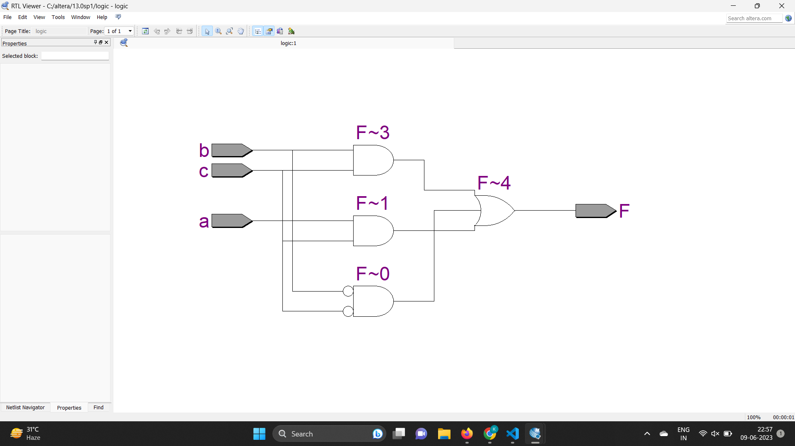
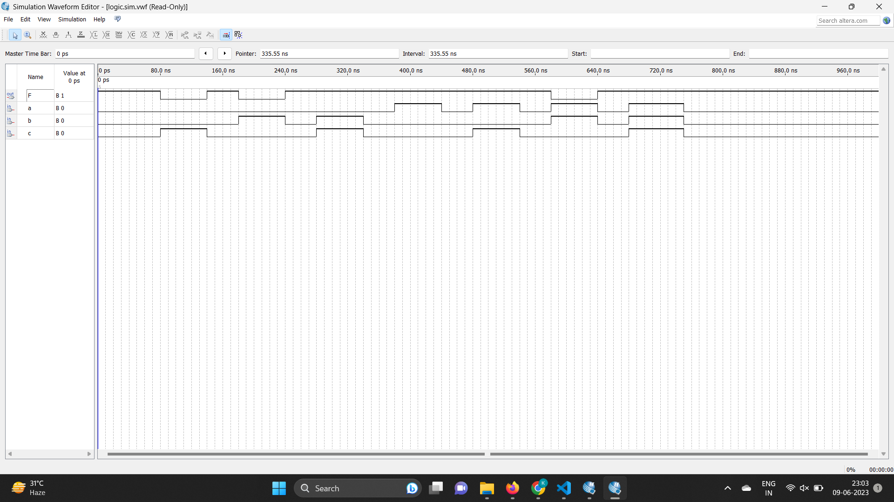

# TITLE
Minimise the function using K map F(A,B,C)=ABC+B'C'+BC+AB' and simulate the logic diagram using verilog.

# THEORY

# PROGRAM

```
module logic(a,b,c,F);
input a,b,c;
output F;
assign F=(((~b&~c)|(a&c))|(b&c));
endmodule
```

# OUTPUT
# RTL VIEWER


# TIMING DIAGRAM

